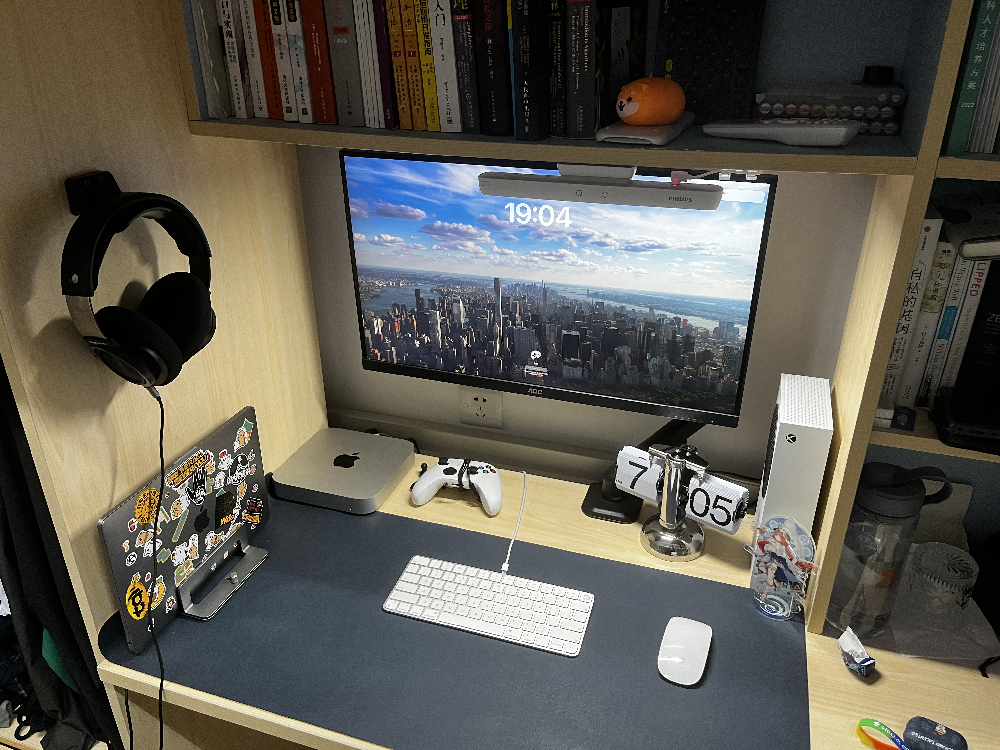

Hi, I'm Ben, a sophomore undergraduate majoring in CS at Southern University of Science and Technology.

My instructor is [Prof.Zhang](https://fengweiz.github.io) who leads the [COMPASS Lab](https://compass.sustech.edu.cn). I'm trying my best towards the research of Computer Security and at the same time, I spend my spare time with CTFs as a member of [COMPASS CTF team](https://wiki.compass.college/).

I work here:

My hobbies include 
 - kendo (a japanese thing)
 - cycling (on-road)
 - table tennis
 - soccer (bad)
 - film photography (can develop and scan myself)
 - video gaming (xbox)
 - music (jazz bebop)

My beloved bike:

Feel free to reach me if u like me!
